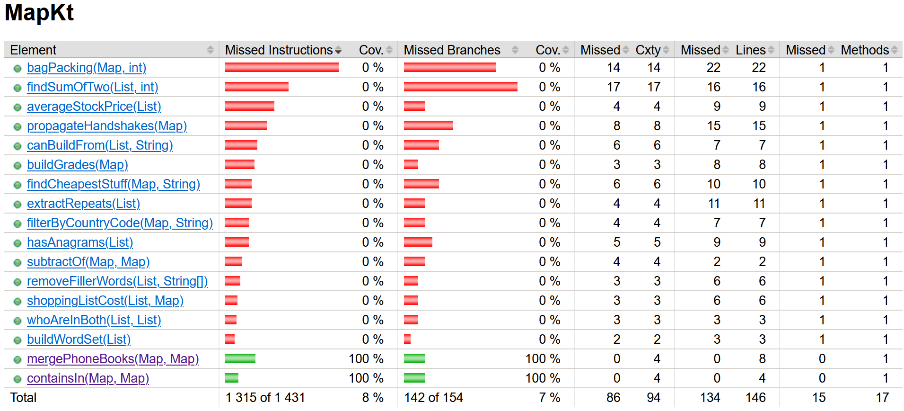
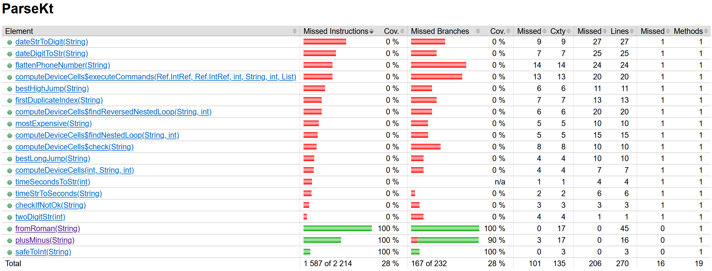
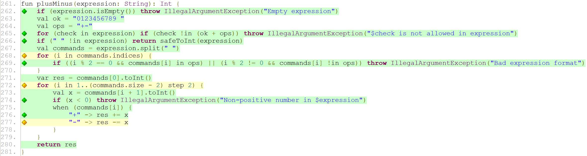
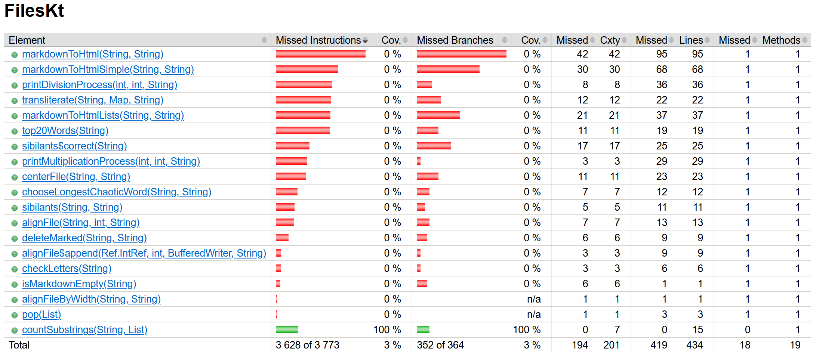

# Краткое summary

Тестовое покрытие измерялось при помощи JaCoCo, которое предлагает нам 2 [метрики](https://www.eclemma.org/jacoco/trunk/doc/counters.html) из коробки: *instruction coverage* и *branch coverage*. Все сгенерированные отчёты находятся в папке jacoco. Тестирование проводилось только на мною написанных тестах, которые находятся в соответствующих папках для lesson'ов (`TestsForSoftwareTesting`).

После запуска команды `mvn clean install` запустилось тестирование, результаты которого можно видеть ниже:

```
Results :

Failed tests: 
  TestsForSoftwareTesting.testFromRoman:101 expected: <-1> but was: <1444>
  TestsForSoftwareTesting.testPlusMinus:55 Expected java.lang.IllegalArgumentException to be thrown, but nothing was thrown.
  TestsForSoftwareTesting.testCountSubstringsGeneratedFile:65 expected: <{kek
kek=10, kek=11}> but was: <{kek=11, kek
kek=0}>

Tests run: 6, Failures: 3, Errors: 0, Skipped: 0
```

Всего было запущено 6 тестов, 3 из которых упали, потому что проверяемые функции были некорректно реализованы с точки зрения задачи.

## lesson 5

В `lesson5` тестировалось две функции: `mergePhoneBooks(Map, Map)` и `containsIn(Map, Map)`. Покрытие можно видеть ниже.



Так как покрытие 100% по обеим метрикам, то комментировать тут нечего.

## lesson 6

В `lesson6` тестировалось две функции: `fromRoman(String)` и `plusMinus(String)`. Покрытие можно видеть ниже.



В функции `plusMinus(String)` покрытие по ветвям составило 90%. Рассмотрим код программы и попробуем определить причину неполного покрытия.



Видно, что не полностью покрытыми являются два цикла и один `when`. Цвета ромбиков могут быть 3 типов:

> - No coverage: No branches in the line has been executed (red diamond)
> - Partial coverage: Only a part of the branches in the line have been executed (yellow diamond)
> - Full coverage: All branches in the line have been executed (green diamond)

Сначала разберёмся со вторым циклом и находящимся в нём `when`. 277 строка подсвечена жёлтым цветом, потому что у нас никогда не происходит ветвления по ветке false при сравнении с минусом. Происходит это из-за того, что по условию задачи имеется лишь 2 операции: сложение и вычитание, остальные мы не считаем корректными и выбрасываем `IllegalArgumentException`. А так как до момента захода в этот цикл обрабатываются все некорректные операции, то у нас может быть лишь 2 значения: "+" и "-". Поэтому на 277 строчке нужно было написать `else`, так как мы точно знаем, что никакие другие операции не могут присутствовать в массиве, из-за чего прохода по ветке false никогда не произойдёт:

```kotlin
when (commands[i]) {
    "+" -> res += x
    else -> res -= x
}
```

Тогда бы 272 и 277 строчки были бы окрашены в зелёный цвет.

Что касается 268 строки, то я не знаю, почему цикл подсвечен жёлтым цветом. При чём наведя курсор на жёлтый ромбик, можно видеть всплывающее окно "1 of 4 branches missed", что говорит нам о том, что какая-то одна ветка не была пройдена. В поисках объяснения в интернете я наткнулся на такой [тред](https://stackoverflow.com/a/53972675/14938288), где объясняется подобная ситуация. Однако в обсуждении идёт речь о форе, где всплывает окно с предупреждением "1 of 2 branches missing" с соответствующими пояснениями, а почему во всем проекте у меня во всех формах пишется про 4 ветвления, я не могу предположить. Но даже если не брать в счёт эти 4 ветвления, то всё равно для меня остаётся загадкой подсвечивание цикла жёлтым цветом, так как есть похожий цикл на 265 строчке, где также выбрасывается исключение, однако он подсвечен зелёным цветом. Либо это баг JaCoCo, либо я чего-то не понимаю до конца.

## lesson 7

В `lesson7` тестировалась лишь одна функция `countSubstrings(String, List)`, покрытие которой можно видеть ниже.



Покрытие функции составило 100%, поэтому комментировать здесь тоже нечего.
