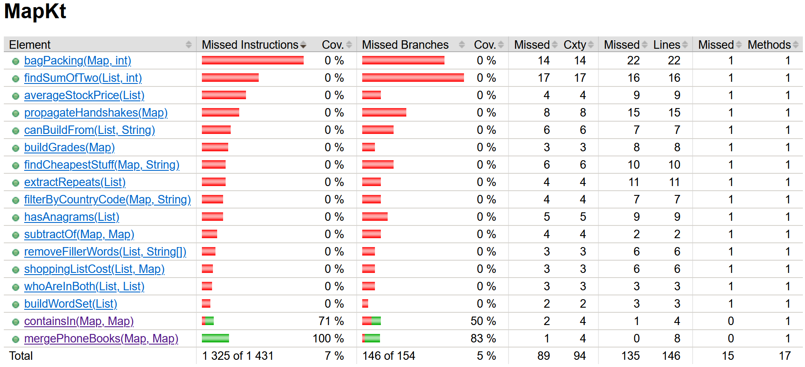
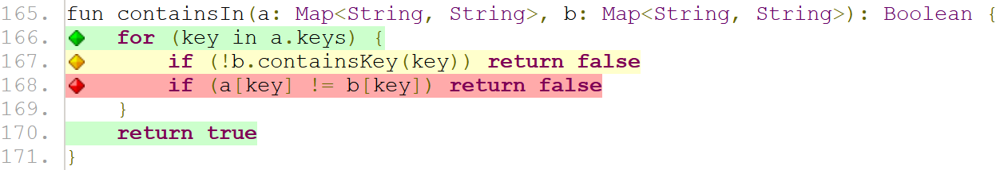
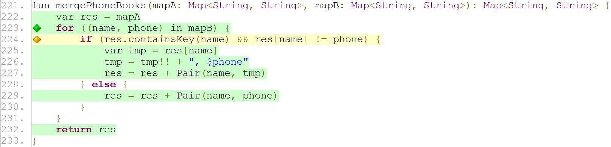
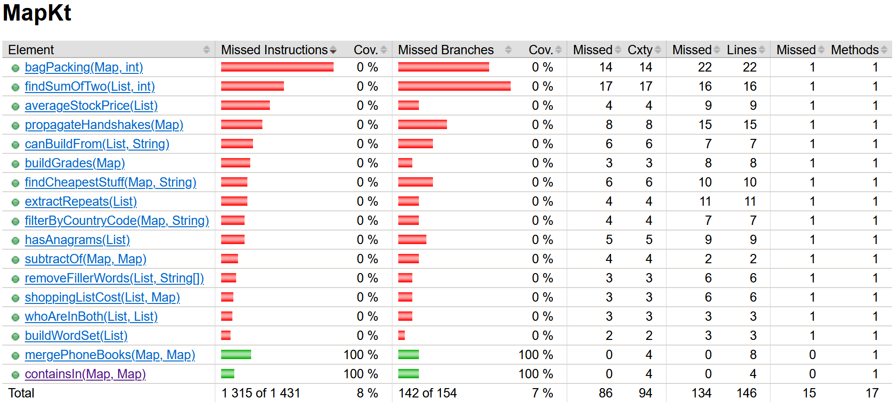
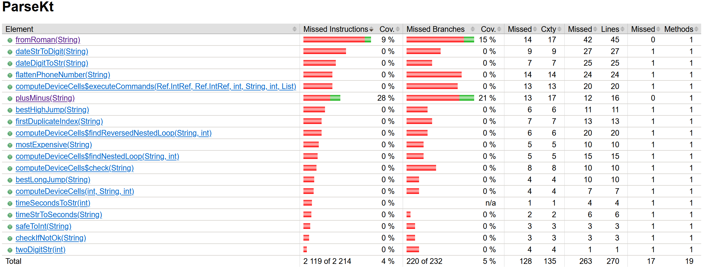
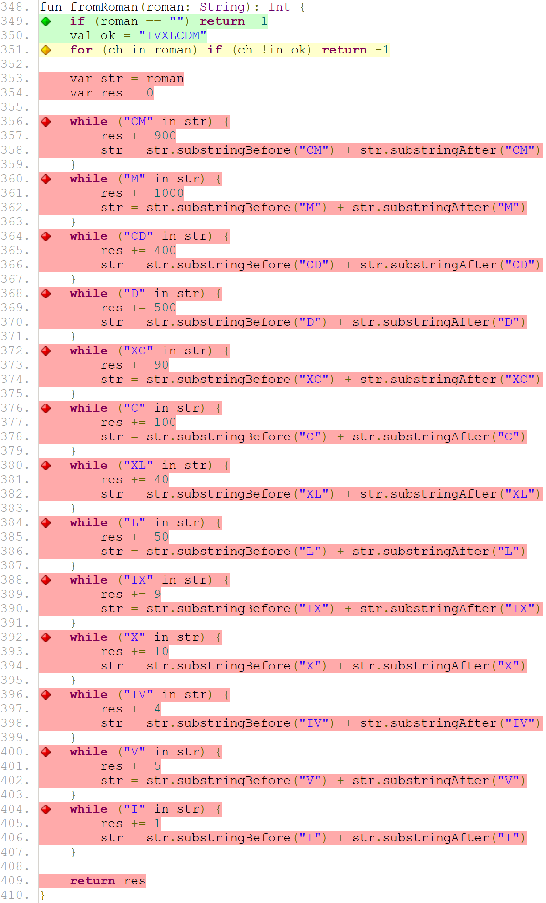
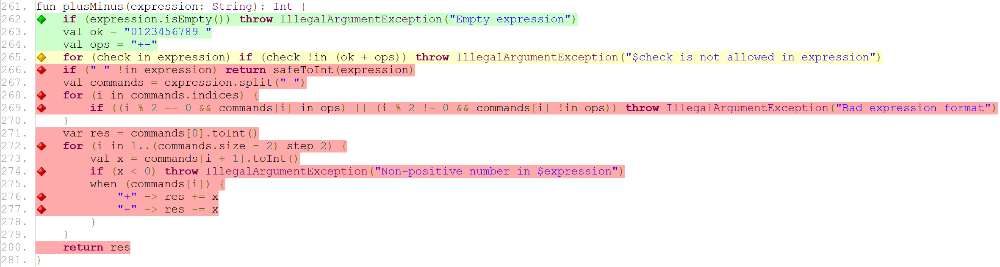
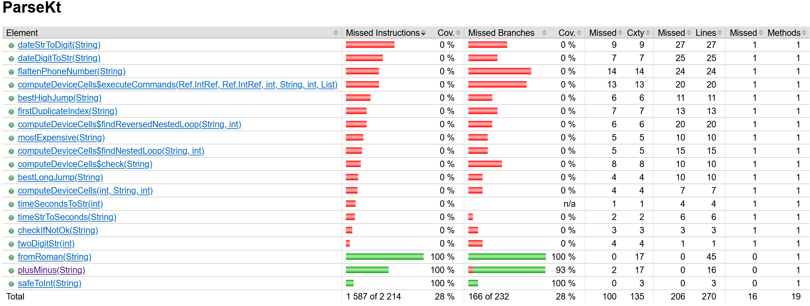
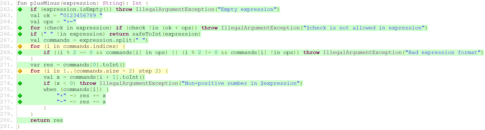
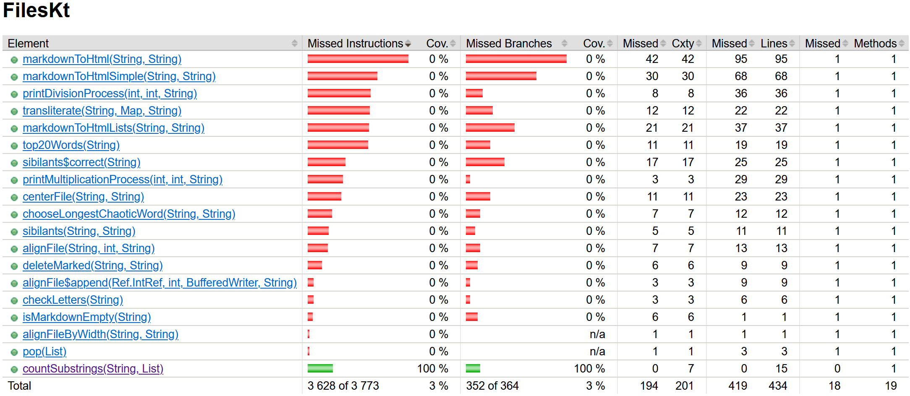

# Краткое summary

В качестве готового фаззера была выбрана библиотека [JQF](https://github.com/rohanpadhye/JQF), которая позволяет генерировать как рандомные входные данные, так и свои структурированные. При чём рандомные входные данные не такие уж и рандомные, так как если fuzzer сгенерирует такие данные, что они пройдут дальше в плане покрытия кода, то с этого момента генерация будет изменена с учётом только что прошедшего набора входных данных. Тестовое покрытие измерялось всё при помощи того же JaCoCo (правда пришлось повозиться несколько часов, чтобы JaCoCo видел тесты фаззинга).

Тесты писались как для классического фаззинга, так и для генерируемого (Generative random testing). Все тесты классического фаззинга находятся в классах `FuzzingTests`, а генерируемого в `GenerativeFuzzingTests`. Также для классического фаззинга был увеличен лимит запусков со стандартных 100 до 1000 или 10000 в зависимости от сложности генерируемых данных. В генерируемом количество запусков стандартное - 100 итераций.

После запуска команды `mvn clean install` только с классическим фаззингом запустился процесс тестирования, результаты которого можно видеть ниже:

```
-------------------------------------------------------
 T E S T S
-------------------------------------------------------
Running lesson5.fuzzing.FuzzingTests
Tests run: 2, Failures: 0, Errors: 0, Skipped: 0, Time elapsed: 59.125 sec - in lesson5.fuzzing.FuzzingTests
Running lesson6.fuzzing.FuzzingTests
Tests run: 2, Failures: 0, Errors: 0, Skipped: 0, Time elapsed: 2.883 sec - in lesson6.fuzzing.FuzzingTests
Running lesson7.fuzzing.FuzzingTests
Tests run: 1, Failures: 0, Errors: 0, Skipped: 0, Time elapsed: 14.726 sec - in lesson7.fuzzing.FuzzingTests

Results :

Tests run: 5, Failures: 0, Errors: 0, Skipped: 0
```

Всего было запущено 5 тестов, которые ни разу не сломали проверяемые функции.

Для генерируемого фаззинга результаты следующие:

```
-------------------------------------------------------
 T E S T S
-------------------------------------------------------
Running lesson5.fuzzing.GenerativeFuzzingTests
Tests run: 11, Failures: 0, Errors: 0, Skipped: 0, Time elapsed: 3.117 sec - in lesson5.fuzzing.GenerativeFuzzingTests
Running lesson6.fuzzing.GenerativeFuzzingTests
Tests run: 112, Failures: 103, Errors: 0, Skipped: 0, Time elapsed: 1.224 sec <<< FAILURE! - in lesson6.fuzzing.GenerativeFuzzingTests
Running lesson7.fuzzing.GenerativeFuzzingTests
Tests run: 51, Failures: 49, Errors: 0, Skipped: 0, Time elapsed: 0.206 sec <<< FAILURE! - in lesson7.fuzzing.GenerativeFuzzingTests

Results :

Tests run: 26, Failures: 3, Errors: 0, Skipped: 0

[ERROR] There are test failures.
```

Таким образом, было запущено всего 26 тестов, 4 из которых упали из-за того, что некоторые проверяемые функции реализованы неправильно с точки зрения поставленной задачи.

## lesson 5

В `lesson5` тестировалось две функции: `containsIn(Map, Map)` и `mergePhoneBooks(Map, Map)`. 

### Классический fuzzing



В функции `containsIn(Map, Map)` покрытие по инструкциям составило 71%, а по ветвям 50%. Покрытый код функции можно видеть ниже.



На рисунке видно, что первый `if` покрыт не полностью, а второй и вовсе не был достигнут при тестировании. Это говорит нам о том, что случайно сгенерированные мапы даже не имели одинаковых ключей, иначе второй `if` был бы как минимум жёлтым.

В функции `mergePhoneBooks(Map, Map)` покрытие по инструкциям составило 100%, а вот по ветвям всего 83%. Покрытый код можно видеть ниже.



Здесь были пройдены не все возможные условия, а если конкретно, то лишь одно, так как наведя на жёлтый ромбик всплывает окно окно "1 of 4 branches missed". Какое конкретно условие не было пройдено - сказать невозможно. Можно лишь утверждать, что это неудовлетворяющее условие, так как в `if` стоит логическое И, то есть из 4 возможных комбинаций условию будет удовлетворять лишь одна, а положительное ветвление раскрашено в зелёный цвет, значит как минимум один раз по этой ветке был проход.

### Generative random testing



В генерируемом фаззинге покрытие для обеих функций по обеим метрикам составило 100%, что намного лучше классического фаззинга, правда и времени на написание этих тестов было потрачено в разы больше.

Тестовое покрытие осталось на том же уровне, что и в результатах исследования [3 лабораторной работы](https://github.com/alexnevskiy/KotlinAsFirst2021Testing/blob/master/results/coverage/report.md#lesson-5).

## lesson 6

В `lesson6` тестировалось две функции: `fromRoman(String)` и `plusMinus(String)`.

### Классический fuzzing



В функции `fromRoman(String)` покрытие по инструкциям составило ничтожные 9%, а по ветвям 15%. Покрытый код функции можно видеть ниже.



Видно, что дальше 351 строчки тестирование не зашло, так как ни одна сгенерированная строка не содержала только символы римской системы счисления.

В функции `plusMinus(String)` покрытие будет получше, однако всё равно далеко от идеала: 28% по инструкциям и 21% по ветвям.



Из рисунка видно, что проблема точно такая же, что и у `fromRoman(String)` - входная строка не содержала корректные для функции символы.

### Generative random testing



Как и в предыдущей лабораторной работе тестовое покрытие функции `fromRoman(String)` достигло максимума, а `plusMinus(String)` немного не дотянул до идеала - лишь 93% покрытия по ветвям. Этот результат оказался на 3% лучше, чем покрытие тестами [модульного тестирования](https://github.com/alexnevskiy/KotlinAsFirst2021Testing/blob/master/results/coverage/report.md#lesson-6).



По сравнению с результатами классического fuzzing'а практически всё окрашено в зелёный, а если сравнивать с покрытием из 3 лабораторной работы, то недостающее состояние на 277 строчке наконец было достигнуто. Скорее всего этого позволил достичь тест-кейс с пробелами вместо знаков операции, так как такой случай при написании модульных тестов я ранее не рассматривал. Однако мои догадки по поводу зависимости неполного покрытия 272 строчки от 277 полностью провалились, так как даже при полностью окрашенным в зелёный цвет теле цикла он всё равно остаётся не полностью покрытым с точки зрения ветвления. Что касается возможных причин неполного ветвления в этих двух циклах, то моя позиция остаётся неизменной - не могу предположить, что нужно сделать, чтобы эти две строчки кода считались полностью покрытыми.

## lesson 7

В `lesson7` тестировалась лишь одна функция `countSubstrings(String, List)`.

### Классический fuzzing


В тестируемой функции классический fuzzing дал свои плоды - покрытие составило 100% по обеим метрикам. Значит можно сделать вывод, что был сгенерирован список, элемент которого содержался в текстовом файле.

### Generative random testing



Генерируемые входные данные также достигли 100% покрытия по обеим метрикам, как классический fuzzing, так и модульные тесты в [3 лабораторной работе](https://github.com/alexnevskiy/KotlinAsFirst2021Testing/blob/master/results/coverage/report.md#lesson-7).

## Выводы

По проделанной работе можно сделать вывод, что fuzzer - это очень интересная штука. С одной стороны можно воспользоваться готовым генератором и просто подавать функции на вход генерируемые данные, а с другой можно самому написать генератор, который будет подавать на вход функции корректные данные. Думаю, что если классическому fuzzer'у дать всё время, что я потратил на разбирательство с библиотекой и написание тестов для Generative random testing (порядка 10-12 часов), то рандомные входные данные дали бы результаты не хуже, а может даже и лучше, чем Generative random testing.
